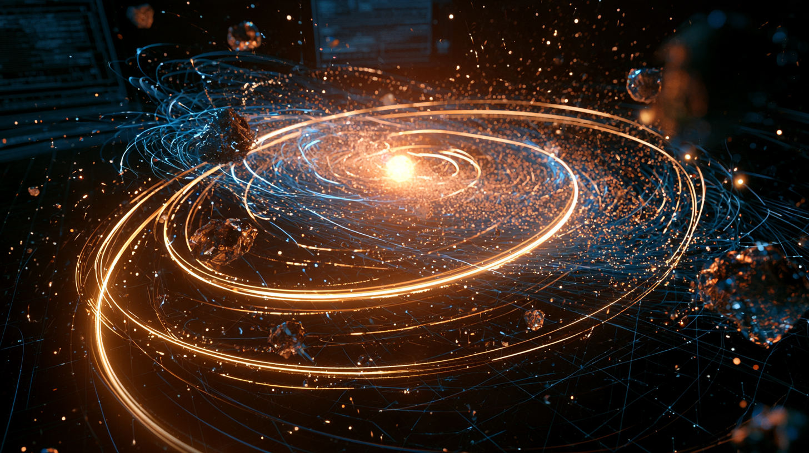

# Orbital Sizing & Assessment Protocol (OSAP)
*Predictions of Small-Body Physical Traits Based on Orbital Characteristics for Mining of Precious Metals for Use in MHD Satellites* \
Commissioned by the [Ethereal Mining Company (EMC)](https://github.com/Ethereal-Mining-Company)

[Micro Project 1](main.ipynb#project-1)\
[Small Body Project Repo](https://github.com/Ethereal-Mining-Company/small-body-project) \
Christopher Doupis \
October 11, 2026

> [!NOTE]
> ### **AI Use Disclosure & Academic Integrity Compliance**
> In compliance with the [**National University Student Guidelines for Generative AI**](https://resources.nu.edu/ai/ai-guidelines), this project discloses the following tool usage:
>
> * **Brainstorming & Dataset Selection (No Citation Required):** **Google Gemini** and **OpenAI ChatGPT** were utilized to brainstorm and isolate a viable machine learning regression scope project for the author selected [JPL NASA Small-Body Dataset](https://ssd.jpl.nasa.gov/tools/sbdb_query.html).
> * **Data Selection & Filtering (Informed by AI):** **Google Gemini** acted as a technical guide to filter query parameters on the [JPL NASA Small-Body Dataset](https://ssd.jpl.nasa.gov/tools/sbdb_query.html) web interface. Based on these logical constraints, a custom CSV file was generated and downloaded manually, which is preserved in the project’s GitHub repository.
> * **Verbiage & Phrasing Refinement (Informed by AI):** **Google Gemini** and **OpenAI ChatGPT** were utilized as writing assistants to polish phrasing and improve technical sentence flow within the title, subtitle, description, problem statement, and hypothesis formulation. All underlying intellectual ideas and scientific goals remain entirely of the author.
> * **Modified Text & Assisted Paragraphs (Cited Inline):** Select technical paragraphs where AI-generated text was slightly modified or adapted by the author are explicitly attributed with inline citations `(OpenAI, 2026)` or `(Google, 2026)` directly within the text documentation.
> * **Creative Material (Direct Quotes and AI-Generated & Author Modified):** Introductory "flavor text" and background narrative elements are either direct quotes by **OpenAI ChatGPT** and **Google Gemini** or generated by **OpenAI ChatGPT** and **Google Gemini** with modifications by the author. These sections are explicitly marked with `[AI DIRECT QUOTE]` or `[AI GENERATED & AUTHOR MODIFIED]` headers, are included strictly for entertainment purposes only, and are excluded from the graded scientific material.
> * **Disclosure Formatting & Meta-Assistance (AI-Generated & Author Modified):** **Google Gemini** was utilized to structure, edit, and generate the text of this disclosure block to ensure compliance with institutional requirements. This entire block is AI-generated and modified by the author.

## EXECUTIVE SUMMARY
**Project Title:** Orbital Sizing & Assessment Protocol (OSAP) \
**Description:** Predictions of Small-Body Physical Traits Based on Orbital Characteristics for Mining of Precious Metals for Use in MHD Satellites \
**Prepared For:** Almeric Vein-Wright, Vice President of Mining Operations, [Ethereal Mining Company (EMC)](https://github.com/Ethereal-Mining-Company) \
**Target Application:** Pre-Sourcing Feasibility Assessment for Magnetohydrodynamic (MHD) Satellite Production

### Objective
Leverage machine learning to predict small-body dimensions and filter out sub-threshold targets prior to prospecting and exploration phases (OpenAI, 2026).

### Enterprise Directive & Operational Mandate
> **[AI DIRECT QUOTE]** \
>The **[Ethereal Mining Company (EMC)](https://github.com/Ethereal-Mining-Company)** has authorized a strategic expansion mandate requiring the rapid deployment of Magnetohydrodynamic (MHD) satellites. These orbital units are engineered to construct massive inductive siphons, capturing low-density ambient electromagnetic waves and artificially pressurizing them into high-energy streams. This localized cosmic pipeline serves a singular corporate objective: fueling the infrastructure required to expand EMC's industrial capacity and territorial reach across the deep galaxy.
>
>Executing this grand architecture demands vast quantities of precious heavy metals, which must be extracted directly from Small Solar System Bodies. However, to ensure physical extraction is both structurally feasible and profitable for the counting-house, target bodies must exceed strict baseline dimensions. 
>
>Rather than exhausting corporate wealth on active radar arrays or long-range telemetry fleets for every drifting stone, this repository introduces a predictive machine learning protocol. By inferring small-body traits purely from their celestial kinematics, the software automatically filters out sub-threshold targets—safeguarding corporate capital and identifying high-viability candidates for physical prospecting.
<!-- 
### Methodology
### Operational Results & Key Performance Indicators
### Strategic Commercial Takeaway
-->

## PROJECT ROADMAP
### 1. [Problem Statement](main.ipynb#problem-statement)
>**[AI DIRECT QUOTE]** \
>The expansion mandate authorized by the Ethereal Mining Company (EMC) relies entirely on harvesting heavy metals from Small Solar System Bodies to construct our inductive electromagnetic siphons. However, physical extraction operations are only structurally stable and financially viable on targets that exceed strict physical baseline dimensions.
>
>Currently, verifying an asteroid's physical diameter requires deploying long-range telemetry fleets or exhausting capital on active radar arrays. This creates a catastrophic drain on corporate wealth when applied to low-viability, sub-threshold targets.
>
>To safeguard corporate assets, this project addresses the core phenomenon of asteroid structural variance by using data science to analyze readily available celestial kinematics. By mapping how easily observed orbital characteristics correlate to an asteroid's physical size, we can replace expensive telemetry with predictive modeling.

**Technical Objective** \
Leverage machine learning to predict small-body dimensions from cost effective observations to determine if additional research is needed. The resources and financial cost to obtain certain orbital characteristics *(a, e, i, etc.)* used to determine small body diameter are relatively inexpensive and can be completed with basic ground equipment (Murcia, 2023). Characteristics like absolute magnitude *(H)* are also relatively inexpensive but highly variable and prone to observational error when gathering (Robinson, 2024). In contrast, observations like albedo require specialized telescopes like WISE/NEOWISE to obtain where coverage is limited for such purposes (Ge, 2025). 

While absolute magnitude *(H)* is prone to observational errors, it is required to help predict the diameter of a small-body in a cost effective way. As such, it is possible to build a machine learning regression model utilizing inexpensive characteristics *(a, e, and i)* in addition to necessary characteristics that are prone to observational errors like absolute magnitude *(H)* to predict the diameter of a small-body to determine if more research should be performed for other purposes (Ge et al. 2026).

>[AI GENERATED & AUTHOR MODIFIED]
>| Characteristic Group | Primary Examples | Equipment Needed |
>| :--- | :--- | :--- |
>| **Orbital Mechanics** | $a$, $e$, $i$, $etc.$ | Basic ground telescope[1]|
>| **Intrinsic Brightness** | $H$ | Repeated visual tracking over time that is variable and prone to observational errors[2] | 
>| **Physical Dimensions** | Diameter, Albedo | Space Infrared Telescopes (WISE) or Radar**[3]** |
>
>* **[1]**Murcia et al. (2023)
>* **[2]**Robinson et al. (2024)
>* **[3]**Ge et al. (2025)

### 2. [Hypothesis Formulation](main.ipynb#hypothesis-formulation)
Small-body families are collections of small-bodies that have similar origin (Shams, 2025). Small-bodies that originate from the same events tend to share similar properties (Ge, 2026). As such, the hypothesis is that using machine learning regression, it is possible to use an established observational dataset to build a model to determine the diameter of a small-body from patterns of similar characteristics among similar size small-bodies. Since there are many variables that need to be used, methods like decision trees and random forest are well suited to build this type of regression (Bora, 2024).

### 3. [Acquire](main.ipynb#acquire)
Dataset acquired from [JPL NASA Small-Body Dataset](https://ssd.jpl.nasa.gov/tools/sbdb_query.html) and filtered by asteroid with a diameter greater than zero kilometers (0 km).

### 4. [Prepare](main.ipynb#prepare)
Data has been prepared for regression analysis in the following ways:
1. **All entries with a missing diameter have been removed.** Diameter is the target variable so it must be in the model data for the coefficient of determination (r2).
1. **The 'albedo' column has been removed.** This represents an expensive observational point that we do not want to factor into the model. This makes sure there is no bias or correlation with this variable and the target variable.
1. **Certain columns were selected to represent the variables to be used in the model.** This ensure we only look at key data that is relevant to the model. These are the more readily available and cost effective observations needed to predict the target variable. 

## REFERENCES
### Peer Reviewed and Scientific References
* **Bora, C. A., Kushvah, B. S., Mouli, G. C., & Yousuf, S.** (2024). Temporal trends in asteroid behaviour: a machine learning and N-body integration approach. Monthly Notices of the Royal Astronomical Society, 534(1), 415–430. https://doi.org/10.1093/mnras/stae2083
* **Ge, J., Zhang, X., Li, J., Zhang, Y., & Jiang, X.** (2026). Asteroid Albedo and Size Inversion: A Deep Learning Method and Application Based on Multiparameters. The Astrophysical Journal Supplement Series, 285(1), 24. https://doi.org/10.3847/1538-4365/ae74b4
* **Ge, J., Zhang, X., Li, J., Wang, H., Xu, D., & Jiang, X.** (2025). Asteroid Types, Albedos, and Diameters Catalog from Gaia DR3: Intelligent Inversion Results via Multisource Information Fusion. The Astrophysical Journal Supplement Series, 280(1), 17. https://doi.org/10.3847/1538-4365/adefe1
* **Murcia, J., Molina, N., Gámez López, M. E., Méndez, N., Mafla, E., & Delgado-Correal, C.** (2023). Optimization of Gauss Method to describe with most accuracy the orbits of Near Earth Asteroids - NEAs. Proceedings of the International Astronomical Union, 19(S374), 15–23. https://doi.org/10.1017/s1743921324000772
* **Robinson, J. E., Fitzsimmons, A., Young, D. R., Bannister, M., Denneau, L., Erasmus, N., Lawrence, A., Siverd, R. J., & Tonry, J.** (2024). Main-belt and Trojan asteroid phase curves from the ATLAS survey. Monthly Notices of the Royal Astronomical Society, 531(1), 304–326. https://doi.org/10.1093/mnras/stae966
* **Shams, F. A., Nafiz, A. A. M., Mohosheu, Md. S., Hoque, M. M., Abir, S. R., Ratul, R. H., Mushfique, Md. M. R., Nazim, A. Ibn, Khan, R. R., Mahmudunnobe, M., & Kabir, M.** (2025). Asteroid family classification with machine learning: Investigative analysis of a novel two-step approach for categorizing known small asteroid families⋆. Experimental Astronomy, 59(1). https://doi.org/10.1007/s10686-025-09982-y
* **Williams, C.** (2026). Space mining and scientific knowledge of asteroids: Implications for policy in a context of national interest. Space Policy, 101785. https://doi.org/10.1016/j.spacepol.2026.101785

### **Generative AI & Software Tools**
* **Google.** (2026). *Gemini* [Large language model]. https://google.com
* **Midjourney.** (2026). *Midjourney* [Image generation software]. https://midjourney.com
* **National Aeronautics and Space Administration (NASA) / Jet Propulsion Laboratory (JPL). (n.d.). JPL Small-Body Database Search Engine.** Retrieved from https://ssd.jpl.nasa.gov/tools/sbdb_query.html
* **OpenAI.** (2026). *ChatGPT* [Large language model]. https://openai.com
<!--
References reserved for later use
* **NASA Office of Inspector General NASA’s Implementation and Management of Its Planetary Defense Strategy.** (2025). https://oig.nasa.gov/wp-content/uploads/2025/06/final-report-ig-25-006-nasas-implementation-and-management-of-its-planetary-defense-strategy.pdf
* **NASA Science Editorial Team.** (2022, December 6). NASA’s NEO Surveyor Successfully Passes Key Milestone. NASA Science. https://science.nasa.gov/blogs/neo-surveyor/2022/12/06/nasas-neo-surveyor-successfully-passes-key-milestone/
-->